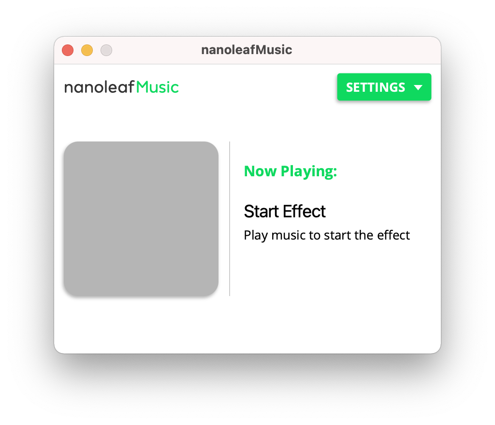
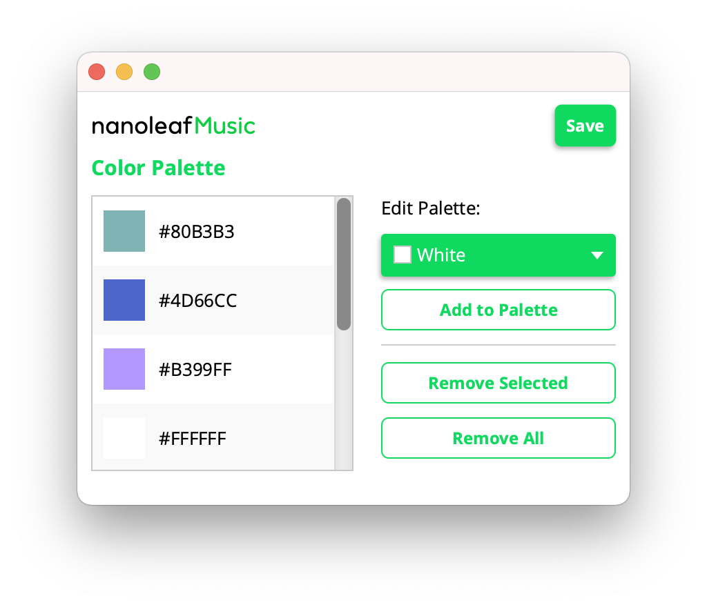
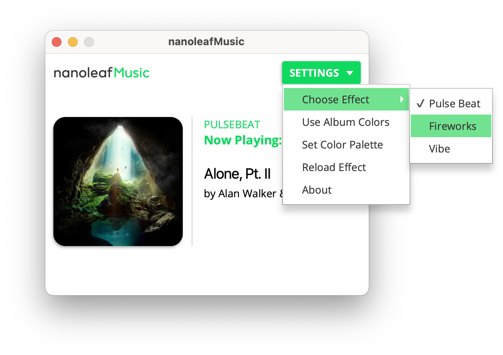

# NanoleafMusic
### Notice: v2 is getting started with development very soon. Keep an eye on this repo for updates.

> Sync your Nanoleaf Light Panels with Spotify

NanoleafMusic is a quick and easy tool to sync your Spotify playback with your Nanoleaf light panels. It doesn't even require a rhythm module. You can use it with your own color palette, or have it use colors from the album art.

## Installation

Installation is super simple, and you can install this program like you would most other programs on your platform. A Java runtime is packaged with the program.

Packages are available for:

- [MacOS (.dmg file)](https://github.com/jaxcksn/nanoleafMusic/releases/download/v1.1/nanoleafMusic-1.1.dmg)
- [Windows x64(.msi file)](https://github.com/jaxcksn/nanoleafMusic/releases/download/v1.1/nanoleafMusic-1.1.msi)

## Usage

### Step 1: Connecting to your Nanoleaf

  

To connect your device, you must be on the same network as the device. Once you load the program, you should a list of the devices on the network. _If you don't see any devices, try pressing refresh a couple times._

Select the device you want to connect too, and press the connect button.  A dialog will pop up to prompt you to start the authorization process. To do this, press and hold the power button on the device controller until the LED indicator starts flashing white. Then press the OK button in the program. 

##### Step 1.5: Saving Device Info

Once you connect to a device, you will be asked if you want to save the device information for easy reconnection. Pressing yes will save the device host, port, and the access token to your platforms default [preferences location](https://victor.kropp.name/blog/java-preferences-api/) .  Pressing save will overwrite any device that is already saved. 

### Step 2: Connecting to Spotify

  

After connecting, you will be prompted to connect to Spotify. To do so, click the _Connect to Spotify_ button, and a browser will be opened. On that page, you will be prompted to sign in to Spotify and then asked if you want to authorize this program. If you accept, you will be redirected to another page and if everything goes correctly you can return to the program.

### Step 3: Starting the Effect

  

To start the effect, just play some music on Spotify.

The effect has two different ways to set the colors, **album art** and **color palette** mode. The default mode is album art, where a 6 color palette is generated using the artwork for the playing track. The color palette mode lets you pick the colors you want. To enable this, open the settings dropdown and disable the _Use Album Colors_ checkbox. Then press the _Set Color Palette_ button. 

##### Setting the Color Palette

  

To add a color to the palette, use the color selection dropdown, and then press the _Add Color_ button to add it to the list. To remove a color from the palette, select the color in the list, then press the remove button. Finally, press the save button to apply your changes and update the colors. To go back to album art mode, open the settings drop down and enable it again. When you exit the program, both your color palette and color made will be saved for next time. 

##### Switching the Effect

  

To change the effect, open the setting drop down, and move your mouse over the 'Choose Effect' option and another menu, with the [available effects](#available-effects) should appear. Your current effect will appear above the 'Now Playing' label in the playback view.

## Troubleshooting

* **Your Nanoleaf Device is not showing up on the list of devices**

  - Check to make sure you are on the same LAN as your Nanoleaf device, and that you can listen for and send MDNS packets.

  - Press the refresh button and see if it shows up. Sometimes the program fails in the initial MDNS discovery and can take a few tries to find the device.

    

* **I can't connect to Spotify**

  * Make sure you are accepting the prompts in your browser and on the same device the program is running on. It listens at localhost on port 8001 for the response from Spotify.

    

* **I've changed the song, but the program doesn't show the song has changed.**

  * It can take a moment for the program to notice the song has changed, but once you see it change on the program, it should be reflected on the device.
  * If it still doesn't respond, in the settings menu there is a _reload effect_ button. Press that to restart the effect. If it doesn't work, I recommend restarting the program.

## Available Effects:
- Pulse Beat: The classic and original effect. Creates a ripple that pulses out from a random panel on every beat.
- Fireworks: Lights up a random group of panels on every beat, like distant fireworks. 
- Vibe: More minimal and bright, on every beat the color of a random panel gets brighter, and every bar the color changes.

## Future Goals

All of my future goals for releases are in the project section of this repository, and you can keep track of the progress of them. If you have any suggestions for features, you can open an issue and I'll look into it.

## Credits

### Acknowledgements / Thanks

**HUGE** shoutout and thank you to [Ethan Rowan](https://github.com/rowak) and their prior work with the Nanoleaf API, especially their excellent [API wrapper](https://github.com/rowak/nanoleaf-aurora) and [desktop program](https://github.com/rowak/nanoleaf-desktop). Their program inspired this project. 

### Used Libraries 

- [Nanoleaf Aurora](https://github.com/rowak/nanoleaf-aurora) package
- [Spotify Web API Java](https://github.com/thelinmichael/spotify-web-api-java) package
- [Color Thief Java](https://github.com/SvenWoltmann/color-thief-java) package under the [Creative Commons Attribution 2.5 License](http://creativecommons.org/licenses/by/2.5/)
